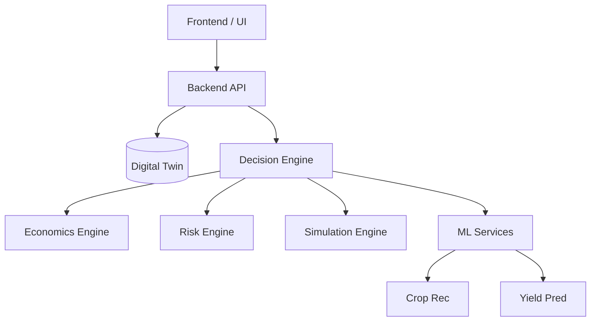

# Architecture

## Core Concept
KisanCare is an AI-powered Farm Digital Twin and Farm Decision Intelligence platform.

**Data Flow:**
Farmer Data → Data Fusion → Farm Digital Twin → Prediction → Simulation → Risk + Economics → Explainable Decision → Farmer Action → Actual Outcome → Farm Memory → Digital Twin improves

**Philosophy:**
OBSERVE → PREDICT → SIMULATE → COMPARE → DECIDE → LEARN

## System Architecture

## ML & AI Copilot Principle
The LLM is **NOT** responsible for agricultural predictions.
Specialized ML models provide predictions (yield, risk, crop, etc.).
The AI Copilot orchestrates and explains these results.
